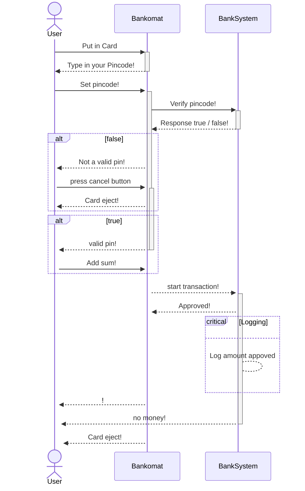

# iths-mermaid-demo


```mermaid
sequenceDiagram;
    Actor User;
    
    User->>+Bankomat: Put in Card;
    Bankomat-->>-User: Type in your Pincode!;
    User->>+Bankomat: Set pincode!;
    activate Bankomat;
        Bankomat->>+BankSystem: Verify pincode!;

        BankSystem-->>-Bankomat: Response true / false!;

        alt false;
            Bankomat-->>+User: Not a valid pin!;
            User->>+Bankomat: press cancel button;
            Bankomat-->>+User: Card eject!;
        end;
        alt true;
        Bankomat-->>-User: valid pin!;
    deactivate Bankomat;
            User->>+Bankomat: Add sum!;
        end;
        
    activate BankSystem;
    
    Bankomat-->>+BankSystem: start transaction!;
    BankSystem-->>+Bankomat: Approved!;
    
    critical Logging
    option 
        BankSystem-->BankSystem: Log amount appoved
    end
    
    
    Bankomat-->>+User: $$$$!;
    BankSystem-->>+User: no money!;
    deactivate BankSystem;
    Bankomat-->>+User: Card eject!;
```
 
 ```sequenceDiagram;
    Actor User;
    
    User->>+Bankomat: Put in Card;
